
# Cousera Machine Learning 
  

<!-- TOC -->

- [Cousera Machine Learning](#cousera-machine-learning)
- [Week1](#week1)
    - [Introduction](#introduction)
        - [What is Machine Learing](#what-is-machine-learing)
            - [Machine Learning difinition:](#machine-learning-difinition)
            - [Supervised Learning (教師あり学習)](#supervised-learning-教師あり学習)
            - [Unsupervised Learning (教師なし学習)](#unsupervised-learning-教師なし学習)
    - [Linear Regression with One Variable (線形回帰,線形回帰)](#linear-regression-with-one-variable-線形回帰線形回帰)
        - [Model](#model)
        - [Parameter Learning](#parameter-learning)
            - [Gradient decent](#gradient-decent)
            - [Gradient decentの動き](#gradient-decentの動き)
    - [Linear Algebra Review](#linear-algebra-review)
- [WEEK 2](#week-2)
    - [Linear Regression with Multiple Variables](#linear-regression-with-multiple-variables)
        - [Multivavariate Linear Regression](#multivavariate-linear-regression)
        - [Computing Parameters Analytically](#computing-parameters-analytically)
    - [Octave/Matlab Tutorial](#octavematlab-tutorial)
- [WEEK 3](#week-3)
    - [Logistic Regression](#logistic-regression)
        - [Classification and Representaion](#classification-and-representaion)
        - [Logistic Regression Model](#logistic-regression-model)
        - [Multiclass Classification](#multiclass-classification)
    - [Regularization](#regularization)
        - [Solving the Problem of Overfitting](#solving-the-problem-of-overfitting)
- [WEEK 4](#week-4)
    - [Neural Networks: Representation](#neural-networks-representation)
        - [Motivations](#motivations)
        - [Neural Networks](#neural-networks)
        - [Applications](#applications)
- [WEEK 5](#week-5)
- [Neural Networks: Learning](#neural-networks-learning)
    - [Cost Function and Backpropagation](#cost-function-and-backpropagation)
    - [Backpropagation in Practice](#backpropagation-in-practice)
    - [Application of Neural Networks](#application-of-neural-networks)
- [WEEK 6](#week-6)
    - [Advice for Applying Machine Learning](#advice-for-applying-machine-learning)
        - [Evaluating a Learning Algorithm](#evaluating-a-learning-algorithm)
        - [Bias vs Variance](#bias-vs-variance)
    - [Machine Learning System Design](#machine-learning-system-design)
        - [Building a Spam Classifier](#building-a-spam-classifier)
        - [Handling Skewed Data](#handling-skewed-data)
        - [Using Large Data Sets](#using-large-data-sets)
- [WEEK 7](#week-7)
    - [Support Vector Machines](#support-vector-machines)
        - [Large Margin Classification](#large-margin-classification)
        - [Kernels](#kernels)
        - [SVMs in Practice](#svms-in-practice)
- [WEEK 8](#week-8)
    - [Unsupervised Learing](#unsupervised-learing)
        - [Clustering](#clustering)
    - [Dimensionality Reduction](#dimensionality-reduction)
        - [Motivation](#motivation)
        - [Principal Component Analysis](#principal-component-analysis)
        - [Applying PCA](#applying-pca)
- [WEEK 9](#week-9)
    - [Anomaly Detection](#anomaly-detection)
        - [Density Estimation](#density-estimation)
        - [Building an Anomaly Detection System](#building-an-anomaly-detection-system)
        - [Multivariate Gaussian Distribution (Optional)](#multivariate-gaussian-distribution-optional)
    - [Recommender Systems](#recommender-systems)
        - [Prediction Movie Ratings](#prediction-movie-ratings)
        - [Collaborative Filtering](#collaborative-filtering)
        - [Low Rank Matrix Factorization](#low-rank-matrix-factorization)
- [WEEK 10](#week-10)
    - [Large Scale Machine Learning](#large-scale-machine-learning)
        - [Gradient Descent with Large Datasets](#gradient-descent-with-large-datasets)
        - [Advanced Topics](#advanced-topics)
- [WEEK 11](#week-11)
    - [Application Example: Photo OCR](#application-example-photo-ocr)
        - [Photo OCR](#photo-ocr)

<!-- /TOC -->

# Week1

## Introduction

### What is Machine Learing

#### Machine Learning difinition:  
• ArthurSamuel(1959).MachineLearning:Fieldof study that gives computers the ability to learn without being explicitly programmed.  
• TomMitchell(1998)Well-posedLearning Problem: A computer program is said to learn from experience E with respect to some task T and some performance measure P, if its performance on T, as measured by P, improves with experience E.

Example: playing checkers.
E = the experience of playing many games of checkers
T = the task of playing checkers.
P = the probability that the program will win the next game.
In general, any machine learning problem can be assigned to one of two broad classifications: Supervised learning and Unsupervised learning.

#### Supervised Learning (教師あり学習)
right answers given
* Regression (回帰):Predict continuous valued output
Y = f(X) というモデルの時にYが連続である
* classification (分類):Discrete valued output 
Y = f(X) というモデルの時にYが離散（とびとび）である
(例)  
Regression - Given a picture of a person, we have to predict their age on the basis of the given picture  
Classification - Given a patient with a tumor, we have to predict whether the tumor is malignant or benign. 

#### Unsupervised Learning (教師なし学習)
right answers 'not' given
 
* Clustering: Take a collection of 1,000,000 different genes, and find a way to automatically group these genes into groups that are somehow similar or related by different variables, such as lifespan, location, roles, and so on.

* Non-clustering: The "Cocktail Party Algorithm", allows you to find structure in a chaotic environment. (i.e. identifying individual voices and music from a mesh of sounds at a cocktail party).

## Linear Regression with One Variable (線形回帰,線形回帰)
* この講義で用いられる用語
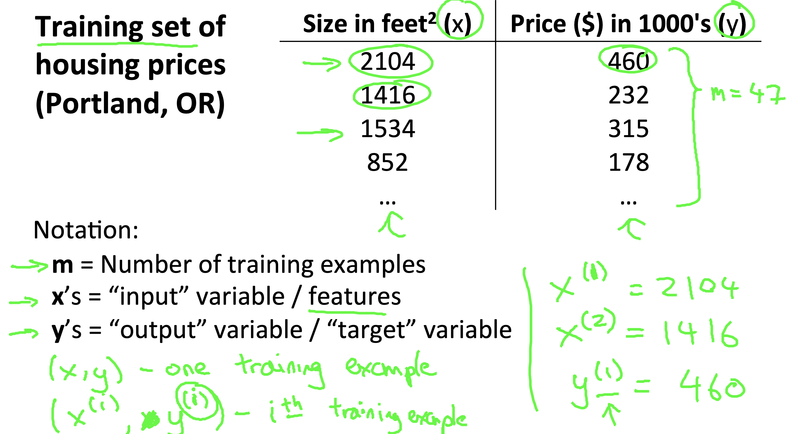 
 

### Model
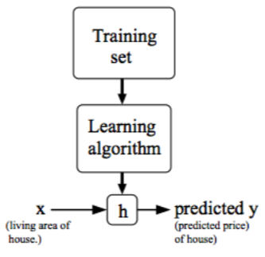  
When the target variable that we’re trying to predict is continuous, such as in our housing example, we call the learning problem a regression problem. When y can take on only a small number of discrete values (such as if, given the living area, we wanted to predict if a dwelling is a house or an apartment, say), we call it a classification problem.  
* Hypothesis Function(仮説関数):yの値を予想してくれる関数のこと。  
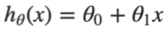

* Cost Function(目的関数):h(x)とyの差の2乗の平均を2で割ったもの0に近づくほど仮説関数が正確に予測できている。この目的関数は、2乗誤差関数と呼ばれる  
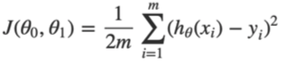  

* 仮説関数と目的関数の関係(仮説関数のパラメーターが1つの場合(分かりやすくするため))  
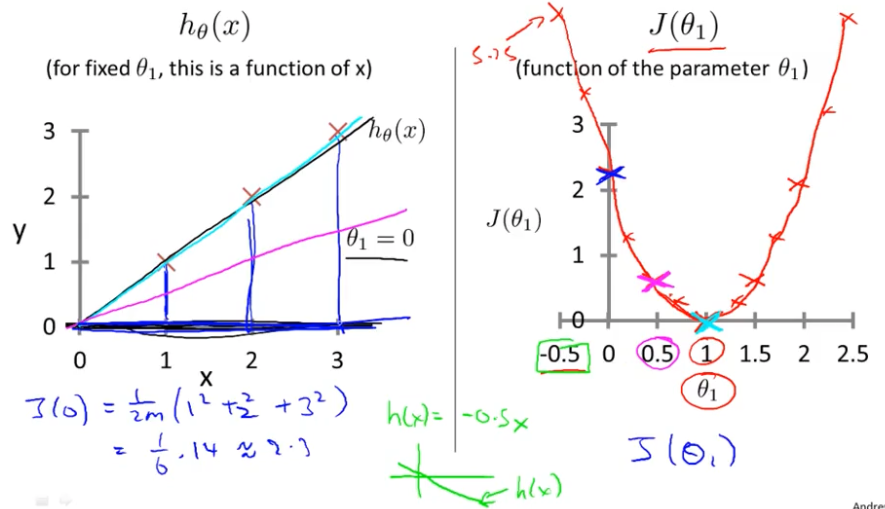  
* 仮説関数と目的関数の関係(パラメーターが2つの場合)  
  
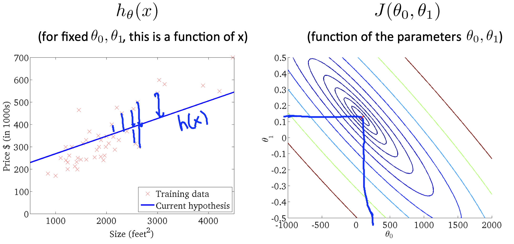  
θ1 and θ2 tend to be around 0.12 and 250 respectively. Plotting those values on our graph to the right seems to put our point in the center of the inner most 'circle'. 

### Parameter Learning

#### Gradient decent
Gradient decent(最急降下法,勾配降下法)というアルゴリズムを用いて目的化関数を最小化(θの更新)する。（線形回帰以外でも使われる）(これから紹介するアルゴリズムは、Batch Gradient Decentと呼ばれる場合もある（θを更新するときに全てのデータセットをみるから))  
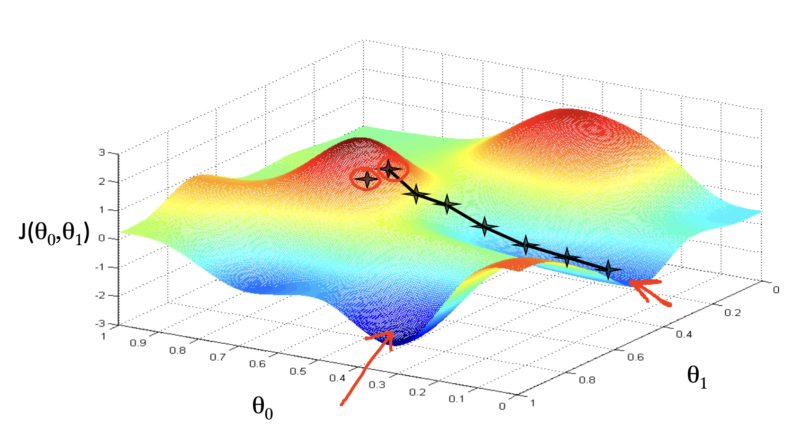  
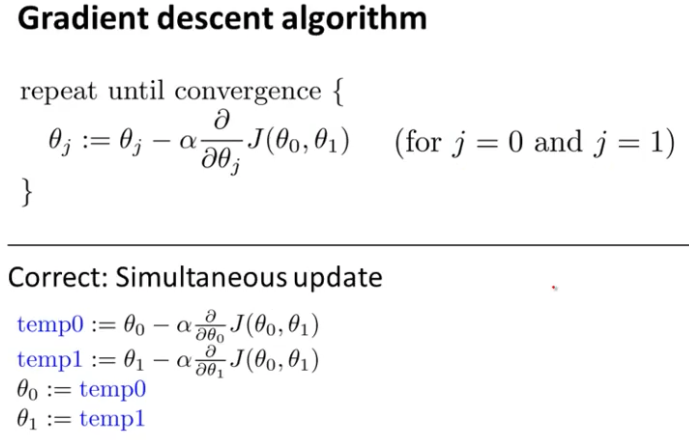  
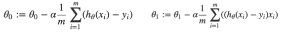  

最急降下法を始める場所(θの初期値)によって局所的最小値が異なる  
θの更新は同時に行う  
α:学習率（αが大きすぎると 大きなステップで降下し収束しない、小さすぎると時間がかかる）  
最小値に近づくにつれ、偏微分の値が小さくなるので、αの更新の必要はない
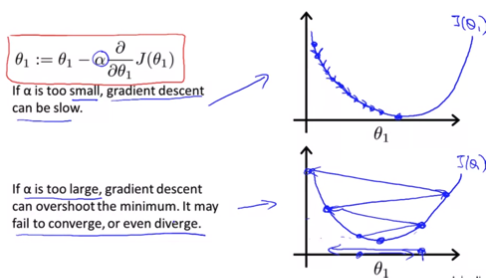  

#### Gradient decentの動き
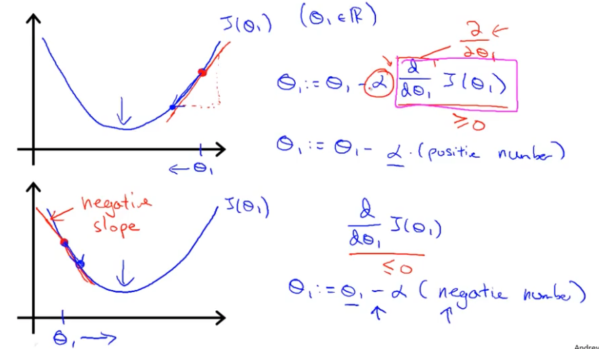  

## Linear Algebra Review

# WEEK 2

## Linear Regression with Multiple Variables

### Multivavariate Linear Regression

### Computing Parameters Analytically

## Octave/Matlab Tutorial

# WEEK 3 

## Logistic Regression

### Classification and Representaion

### Logistic Regression Model

### Multiclass Classification

## Regularization

### Solving the Problem of Overfitting

# WEEK 4 

## Neural Networks: Representation

### Motivations

### Neural Networks

### Applications

# WEEK 5

# Neural Networks: Learning

## Cost Function and Backpropagation

## Backpropagation in Practice

## Application of Neural Networks

# WEEK 6 

## Advice for Applying Machine Learning

### Evaluating a Learning Algorithm

### Bias vs Variance

## Machine Learning System Design

### Building a Spam Classifier

### Handling Skewed Data

### Using Large Data Sets

# WEEK 7 

## Support Vector Machines

### Large Margin Classification

### Kernels

### SVMs in Practice

# WEEK 8 

## Unsupervised Learing

### Clustering

## Dimensionality Reduction

### Motivation

### Principal Component Analysis

### Applying PCA

# WEEK 9 

## Anomaly Detection

### Density Estimation

### Building an Anomaly Detection System

### Multivariate Gaussian Distribution (Optional)

## Recommender Systems

### Prediction Movie Ratings

### Collaborative Filtering

### Low Rank Matrix Factorization 

# WEEK 10 

## Large Scale Machine Learning 

### Gradient Descent with Large Datasets

### Advanced Topics

# WEEK 11 

## Application Example: Photo OCR

### Photo OCR