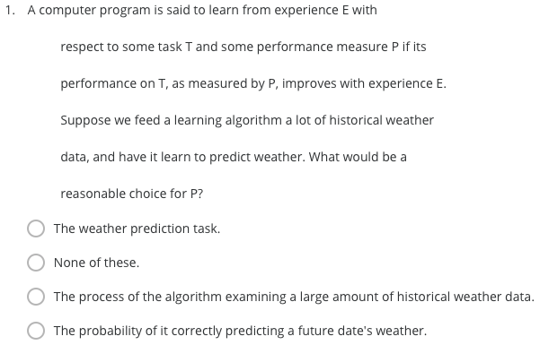
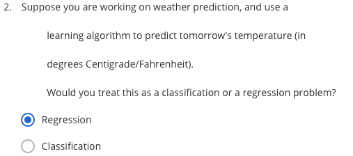
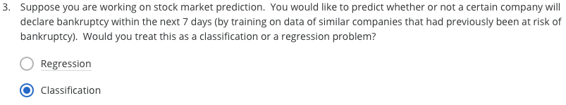
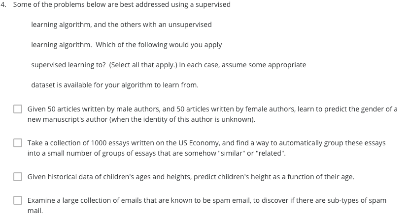
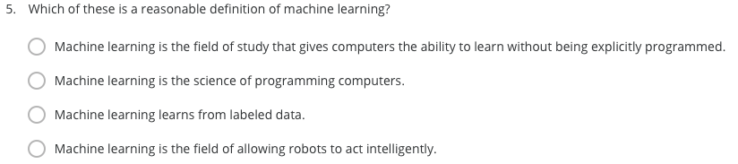

  
ans:The probability of it correctly predicting a future date's weather.
  
ans:Regresssion
  
ans:Classification
    
ans:Given historical data of children's ages and heights, predict children's height as a function of their age.  
Examine a large collection of emails that are known to be spam email, to discover if there are sub-types of spam mail.の2つを選択して間違えた  
  
ans:Machine learning is the field of study that gives computers the ability to learn without being explicitly programmed.